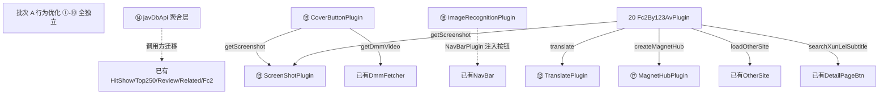

# 78 - 对照 jhs.3.3.6.027 可插拔升级执行方案

> **文档类型**：🔧开发指导
> **文档状态**：✅已执行
> **执行日期**：2026-07-11
> **来源**：对照 `archetype/jhs.3.3.6.027.user.js`（新版 v3.3.6.027）相对 `archetype/jhs.user.js`（旧版 v1.0）的功能更新。
> **范围**：仅 javdb 站点、仅功能实现差异。
> **落地记录**：正式实施与验证见 `doc/76-upgrade-from-336027.md`；对照基准说明见 `doc/77-archetype-336027-reference.md`。
> **核心原则**：所有改动**可插拔式替换**——每项有独立 feature flag，运行时可切换新/旧逻辑，保证对比调试性。
> **归档说明**：原项目根目录 `upgrade-plan-temp.md`（临时执行方案），已迁入 `doc/` 编号归档，内容与已执行落地一致。

---

## 0. 可插拔机制总述

### 0.1 Feature Flag 中心

新建 `src/core/feature-flags.ts`，集中管理全部升级开关。默认全开，可被 localStorage 覆盖，便于在浏览器控制台临时切换以对比新旧行为。

```ts
/**
 * 升级特性开关中心。
 * 运行时读 localStorage['jhs_upgrade_flags']（JSON）覆盖默认值，
 * 便于对比调试：在控制台执行
 *   localStorage.setItem('jhs_upgrade_flags', JSON.stringify({ caseInsensitiveCarNum: false }))
 * 即可回退该项到旧逻辑，刷新页面生效。
 */
export const featureFlags: Record<string, boolean> = {
    // —— 行为优化（批次 A）——
    upgradeSignature300s: true,      // ① 签名缓存 20s→300s
    caseInsensitiveCarNum: true,     // ② 番号大小写不敏感匹配
    autoPageReplaceState: true,       // ③ AutoPagePlugin replaceState
    wantWatchBatchImport: true,       // ④ WantAndWatched 批量导入
    movieShowTypeVisibility: true,    // ⑤ movieShowType 双模式
    storageCacheDeepCopy: true,       // ⑥ StorageManager 缓存深拷贝/冻结
    webdavIdempotentMkdir: true,     // ⑦ WebDav 目录幂等创建
    westernCarFormat: true,           // ⑧ BasePlugin _formatWesternCar
    actressUserSelectAll: true,       // ⑨ ActressInfoPlugin user-select
    navBarNoPaste: true,             // ⑩ NavBarPlugin 移除 paste
    // —— 基础设施 + 独立新插件（批次 B）——
    translatePlugin: true,           // ⑫ TranslatePlugin 独立化
    screenShotPlugin: true,          // ⑬ ScreenShotPlugin
    javDbApiAggregate: true,         // ⑭ javDbApi 聚合层
    // —— 依赖型新插件（批次 C）——
    coverButtonPlugin: true,          // ⑮ CoverButtonPlugin（依赖 ⑬）
    magnetHubPlugin: true,           // ⑰ MagnetHubPlugin
    imageRecognitionPlugin: true,    // ⑱ ImageRecognitionPlugin
    // —— 复合型新插件（批次 D）——
    fc2By123AvPlugin: true,           // 20 Fc2By123AvPlugin（依赖 ⑫⑬⑰）
};

(() => {
    try {
        const stored = JSON.parse(localStorage.getItem('jhs_upgrade_flags') || '{}');
        Object.assign(featureFlags, stored);
    } catch {
        /* 解析失败保持默认 */
    }
})();
```

### 0.2 可插拔落地规则

| 改动类型 | 落地方式 |
|---|---|
| 行为优化（①-⑩） | 在原函数内 `if (featureFlags.xxx) { 新逻辑 } else { 旧逻辑 }`，**保留旧逻辑分支**，不删旧代码 |
| 基础设施（⑭） | 新增聚合对象，原 `api.ts` 函数保留作兼容别名；调用方按 flag 选择走聚合层或散落函数 |
| 新插件（⑫⑬⑮⑰⑱ 20） | main.tsx 注册前 `if (featureFlags.xxx) pluginManager.register(XxxPlugin)`；插件内部 `getBean` 用可选链兼容未注册场景 |

### 0.3 对比调试方法

1. 全部 flag 默认开 → 新版行为
2. 控制台 `localStorage.setItem('jhs_upgrade_flags', JSON.stringify({ 某项: false }))` → 回退该项
3. 刷新页面对比，定位回归
4. 排查完毕恢复 `localStorage.removeItem('jhs_upgrade_flags')`

---

## 1. 依赖关系



---

## 2. 分批执行计划

| 批次 | 项 | 特征 | 风险 |
|---|---|---|---|
| A | ①②③④⑤⑥⑦⑧⑨⑩ | 行为优化，全独立，保留旧分支 | 低 |
| B | ⑫⑬⑭ | 基础设施 + 独立新插件 | 低 |
| C | ⑮⑰⑱ | 依赖型新插件 | 中 |
| D | 20 | 复合型新插件，依赖 B+C | 中 |

建议每批完成后 `tsc -b && vite build` 验证 + 浏览器实测，再进下一批。

---

## 3. 各项详细方案

### ① 签名缓存 20s→300s + removeSignature

- **目标**：签名缓存窗口放大 25 倍；新增主动清除签名能力。
- **涉及文件**：`src/constants/api.ts`
- **开关**：`featureFlags.upgradeSignature300s`
- **改动方案**：
  - 在 `api.ts` 新增 `SIGNATURE_TTL_SECONDS_V2 = 300`、单 key `jhs_jdsignature`（值 = `ts.lpw6vgqzsp.md5`）
  - flag 开时：`reBuildSignature()` 走单 key + 300s 分支；flag 关时走原双 key + 20s
  - 新增 `export function removeSignature()`：flag 开时清 `jhs_jdsignature`；flag 关时清 `jhs_review_ts`/`jhs_review_sign`（兼容）
  - 注意：key 名变更后旧缓存自然失效，无需迁移
- **验证**：控制台调 `reBuildSignature()` 两次间隔 <300s 应返回同值；调 `removeSignature()` 后再调应重算

### ② 番号大小写不敏感匹配

- **目标**：避免 `ABC-123` vs `abc-123` 大小写差异导致查不到/重复入库。
- **涉及文件**：`src/core/storage-manager.ts`、`src/plugins/list-page-plugin.tsx`
- **开关**：`featureFlags.caseInsensitiveCarNum`
- **改动方案**：
  - `StorageManager.getCar(carNum)`：flag 开时 `item.carNum.toLowerCase() === carNum.toLowerCase()`
  - `ListPagePlugin.filterMovieList`：carNumSets 入集用 `item.carNum.toLowerCase()`；查询用 `lowerCarNum = carNum2.toLowerCase()`；`favorite.has(lowerCarNum)` 等
  - 关键词匹配同步：`lowerTitle.includes(kw.toLowerCase())`
  - flag 关时保留原精确匹配
- **验证**：手动入库 `ABC-001`，列表页出现 `abc-001` 时仍能命中状态标签

### ③ AutoPagePlugin replaceState

- **目标**：翻页时不污染浏览器历史栈。
- **涉及文件**：`src/plugins/auto-page-plugin.ts`
- **开关**：`featureFlags.autoPageReplaceState`
- **改动方案**：`updatePageUrl` 内 flag 开时 `window.history.replaceState`，flag 关时 `pushState`
- **验证**：瀑布流翻 3 页后点浏览器后退，应直接离开站点而非回退每页

### ④ WantAndWatched 批量导入优化

- **目标**：O(n) 逐条查重 → O(1) Set 查重；逐条 saveCar → 批量 saveCarList。
- **涉及文件**：`src/plugins/want-and-watched-videos-plugin.tsx`
- **开关**：`featureFlags.wantWatchBatchImport`
- **改动方案**：
  - flag 开时：`parseMovieList` 开头 `const allLocalCars = await storageManager.getCarList()` 建 `carNumCache = new Set(allLocalCars.map(c => c.carNum.toLowerCase()))`
  - 每页收集 `currentPageRecords`，页末 `await storageManager.saveCarList(currentPageRecords)`
  - 已存在用 Set 判定跳过，不再逐条 toast
  - 新增"正在处理第 X 页"进度提示
  - 请求间隔 1000ms→200ms
  - flag 关时保留逐条逻辑
- **验证**：导入 5 页数据，耗时应显著下降；Network 面板请求间隔 ~200ms

### ⑤ movieShowType 双模式

- **目标**：已鉴定内容支持 hide（隐藏）/ visibility（透明占位）两种模式。
- **涉及文件**：`src/plugins/list-page-plugin.tsx`、`src/plugins/setting-plugin.tsx`
- **开关**：`featureFlags.movieShowTypeVisibility`
- **改动方案**：
  - `SettingPlugin` base-panel 新增 `movieShowType` 单选（hide/visibility）
  - `ListPagePlugin.filterMovieList`：flag 开时读 `settings.movieShowType`；`shouldHide` 时按模式分支——`hide` 走 `$box.hide()`，`visibility` 走 `$box.css('border',...).children().css('visibility','hidden')`
  - 用 `data-movieShowType` 标记当前模式，切换时重置
  - flag 关时仅 hide
- **验证**：设置切 visibility，已屏蔽项应占位透明而非消失；切回 hide 恢复隐藏

### ⑥ StorageManager 缓存深拷贝/冻结

- **目标**：读操作返回深拷贝/冻结对象，防外部污染缓存。
- **涉及文件**：`src/core/common-util.ts`（新增工具）、`src/core/storage-manager.ts`
- **开关**：`featureFlags.storageCacheDeepCopy`
- **改动方案**：
  - `common-util.ts` 新增：`copyObj(data) = JSON.parse(JSON.stringify(data))`、`deepFreeze(obj)` 递归 Object.freeze
  - `storage-manager.ts` 缓存字段扩到 4 个（`cacheCarList`/`cacheFavoriteActressList`/`cacheBlacklistCarList`/`cacheSettingObj`）
  - `getCarList`/`getFavoriteActressList`/`getSetting` flag 开时返回 `utils.copyObj(cache)`
  - `getBlacklistCarList` flag 开时返回 `utils.deepFreeze(copyObj(cache))`
  - 写操作统一走私有 `setItem_fn` 内聚缓存失效，不再依赖 `window.cleanCache_*`
  - flag 关时返回原引用
- **验证**：`var x = storageManager.getCarList(); x.push({}); storageManager.getCarList().length` 不变

### ⑦ WebDav 目录幂等创建

- **目标**：重复 MKCOL 不报错。
- **涉及文件**：`src/core/webdav.ts`
- **开关**：`featureFlags.webdavIdempotentMkdir`
- **改动方案**：
  - 新增 `checkFolderExists(path)`：PROPFIND Depth:0，404 返 false
  - 新增 `createFolder(name)`：flag 开时先 check 再 MKCOL；flag 关时直接 MKCOL
  - `backup()`/`getBackupList()` 调用处改用 `createFolder()`
- **验证**：连续备份两次，第二次不应报目录已存在

### ⑧ BasePlugin _formatWesternCar

- **目标**：西方番号 `carNum.YY.MM.DD` 格式化。
- **涉及文件**：`src/plugins/base-plugin.ts`
- **开关**：`featureFlags.westernCarFormat`
- **改动方案**：
  - 新增 `_formatWesternCar(carNum, rawDate)`：carNum 纯字母且 rawDate 含日期时拼 `carNum.YY.MM.DD`
  - `getBoxCarInfo` flag 开时调 `_formatWesternCar` 格式化 carNum
  - flag 关时原样返回
- **验证**：西方番号详情页应显示带日期后缀的格式化番号

### ⑨ ActressInfoPlugin user-select

- **目标**：演员名一键整名复制。
- **涉及文件**：`src/plugins/actress-info-plugin.tsx`
- **开关**：`featureFlags.actressUserSelectAll`
- **改动方案**：演员名 DOM `<strong>` flag 开时加 `style="margin-right:5px"` + 内层 `<span style="user-select:all">`；无信息时显示"暂无此演员信息"
- **验证**：详情页演员名点击应选中整名可复制

### ⑩ NavBarPlugin 移除 paste

- **目标**：避免粘贴图片误触发搜索。
- **涉及文件**：`src/plugins/nav-bar-plugin.tsx`
- **开关**：`featureFlags.navBarNoPaste`
- **改动方案**：paste 事件绑定处 flag 开时跳过绑定；flag 关时保留
- **验证**：搜索框粘贴图片不应自动触发搜索

---

### ⑫ TranslatePlugin 独立化

- **目标**：标题翻译独立成插件，覆盖列表页 + 详情页。
- **涉及文件**：新建 `src/plugins/translate-plugin.ts`；改 `src/plugins/list-page-plugin.tsx`（translate 委托）；改 `src/main.tsx`
- **开关**：`featureFlags.translatePlugin`
- **改动方案**：
  - 新建 `TranslatePlugin extends BasePlugin`：
    - `getName() = 'TranslatePlugin'`
    - `handle()`：详情页时触发 `translate(carNum, showCarNum)`
    - `translate(carNum, showCarNum)`：找标题元素（`.origin-title`→`.current-title`→`h3` 降级链）→ 注入 loading → 读 localStorage `jhs_translate` 缓存 → 调 `translateText(title)` → 渲染 + 缓存
    - 翻译源：Google `translate-pa.googleapis.com/v1/translate`（gtx client，`ja→zh-CN`）
  - `ListPagePlugin.translate` flag 开时委托 `this.getBean('TranslatePlugin')?.translate(carNum, showCarNum)`；flag 关时走原内联逻辑
  - main.tsx：`if (featureFlags.translatePlugin) pluginManager.register(TranslatePlugin)`
  - 现有 `translateText` 函数（应在 api.ts 或 common-util）保留复用
- **依赖**：无
- **验证**：列表页 + 详情页标题均翻译；关 flag 后列表页翻译走原逻辑

### ⑬ ScreenShotPlugin

- **目标**：从 javstore.net 获取影片长缩略图（截图墙）。
- **涉及文件**：新建 `src/plugins/screenshot-plugin.ts`；改 `src/main.tsx`
- **开关**：`featureFlags.screenShotPlugin`
- **改动方案**：
  - 新建 `ScreenShotPlugin extends BasePlugin`：
    - `handle()`：详情页 + `enableLoadScreenShot` 设置开时触发
    - `loadScreenShot()`：注入占位 + 调 `getScreenshot` + `addImg`
    - `getScreenshot(carNum)`：localStorage `jhs_screenShot` 缓存；调 `getJavStoreScreenShot`
    - `getJavStoreScreenShot(carNum)`：`javstore.net` 搜索→番号模糊匹配→详情页→解析 `CLICK HERE`/`_s.jpg`（去 `.th` 后缀）
    - `addImg(title, imgUrl)`：注入 `.screen-container` + 绑定 `showImageViewer`
    - `showErrorFallback(carNum, error)`：失败占位 + 重试
  - main.tsx 注册
- **@connect 需补**：`javstore.net`
- **依赖**：无（被 ⑮ CoverButtonPlugin 复用）
- **验证**：详情页出现截图墙；关 flag 后无截图墙但不报错

### ⑭ javDbApi 聚合层 + markDataListHtml

- **目标**：散落 API 函数聚合成 `javDbApi` 对象 + 新增 markDataListHtml/removeSignature/_updateImgServer/login。
- **涉及文件**：`src/constants/api.ts`；调用方 `src/plugins/hit-show-plugin.tsx`/`top250-plugin.tsx`/`review-plugin.tsx`/`related-plugin.tsx`/`fc2-plugin.ts`
- **开关**：`featureFlags.javDbApiAggregate`
- **改动方案**：
  - `api.ts` 新增 `export const javDbApi = { getReviews, searchMovie, getMovieDetail, related, getMagnets, playback, login, top250, buildSignature, removeSignature, markDataListHtml, _updateImgServer }`
  - 原 `fetchMovieReviews`/`fetchMovieDetail`/`fetchRelatedCollections`/`fetchPlaybackRanking`/`fetchTopMovies`/`reBuildSignature` **保留作兼容别名**（不删）
  - 新增 `_updateImgServer(str)`：`rhe951l4q`→`c0.jdbstatic.com`，`fetchMovieDetail` 内联替换改调它
  - 新增 `markDataListHtml(movies)`：统一列表项 HTML（封面换 CDN、中字/磁链标签）
  - 新增 `login(username, password)`、`getMagnets(movieId)`、`searchMovie(keyword)`
  - 调用方：flag 开时改用 `javDbApi.xxx`；flag 关时用原散落函数
  - `ReviewPlugin` 签名过期时调 `javDbApi.removeSignature()`（依赖 ①）
- **依赖**：①（removeSignature 复用签名清除）
- **验证**：HitShow/TOP250/Review/Related/Fc2 功能不变；签名过期时自动清除后下次请求恢复

### ⑮ CoverButtonPlugin（依赖 ⑬）

- **目标**：列表页封面卡片悬浮工具栏（5 组按钮）。
- **涉及文件**：新建 `src/plugins/cover-button-plugin.tsx`；改 `src/main.tsx`；改 `src/plugins/list-page-plugin.tsx`（doFilter 后触发）、`src/plugins/setting-plugin.tsx`（5 个 SVG 开关 + 弹窗 end 回调）
- **开关**：`featureFlags.coverButtonPlugin`
- **改动方案**：
  - 新建 `CoverButtonPlugin extends BasePlugin`：
    - `addSvgBtn()`：给每个 `.item` 注入 `tool-box`（javdb 注入 `.tags`）
    - `enableSvgBtn()`：读 5 个设置项（enableScreenSvg/enableVideoSvg/enableHandleSvg/enableSiteSvg/enableCopySvg）控制显隐
    - `bindClick()`：事件委托 5 组按钮
    - `showImg($svg,$img,carNum)`：切回封面
    - `showVideo($svg,$img,carNum)`：播放预览视频（`getDmmVideo` + `selectDefaultQuality`）
    - 5 组：screen→`ScreenShotPlugin.getScreenshot`；video→DMM；handle→鉴定子菜单（已观看/已下载/收藏/屏蔽）；site→第三方子菜单（Jable/Avgle/MissAv/123Av）；copy→复制番号/标题/下载封面
  - `ListPagePlugin.doFilter`/`checkDom` flag 开时调 `getBean('CoverButtonPlugin')?.addSvgBtn()`
  - `SettingPlugin` flag 开时新增 5 个 SVG 开关 + `openSettingDialog` 的 `end` 回调调 `enableSvgBtn()`
  - BasePlugin 需新增 `screenSvg`/`videoSvg`/`handleSvg`/`siteSvg`/`copySvg`/`downSvg`/`copySvg` 等 SVG 图标字段
- **依赖**：⑬ ScreenShotPlugin（getScreenshot）；已有 preview-video 的 DmmVideoFetcher
- **验证**：列表页封面悬浮工具栏出现；5 组按钮按设置显隐；关 flag 后无工具栏

### ⑰ MagnetHubPlugin

- **目标**：多引擎磁链搜索聚合（U9A9/U3C3/Sukebei）。
- **涉及文件**：新建 `src/plugins/magnet-hub-plugin.ts`；改 `src/main.tsx`；改 `src/plugins/detail-page-button-plugin.tsx`（磁力搜索按钮）、`src/plugins/fc2-plugin.ts`（磁力搜索按钮）
- **开关**：`featureFlags.magnetHubPlugin`
- **改动方案**：
  - 新建 `MagnetHubPlugin extends BasePlugin`：
    - `createMagnetHub(keyword)`：创建聚合 UI（Tab + 原网页链接 + 结果区）+ 默认引擎搜索
    - `searchEngine($container, engine, keyword)`：GM_xmlhttpRequest，支持 parseHtml/parseJson，sessionStorage 缓存
    - `displayResults($container, results, engineName)`：标题/大小/日期 + 复制磁链 + 115离线下载按钮
    - `parseBTSOW`/`parseU3C3`/`parseSukebei`：三引擎解析
    - 3 引擎：U9A9（u9a9.com）、U3C3（u3c3.com）、Sukebei（sukebei.nyaa.si）
  - `DetailPageButtonPlugin.createMenuBtn` flag 开时新增 `#magnetSearchBtn`→`getBean('MagnetHubPlugin').createMagnetHub(carNum)`
  - `Fc2Plugin.openFc2Dialog` flag 开时新增磁力搜索按钮
  - localStorage `jhs_magnetHub_selectedEngine` 记忆选择
- **@connect 需补**：`u9a9.com`、`u3c3.com`、`sukebei.nyaa.si`、`btsow.lol`
- **依赖**：无（被 ⑮ CoverButtonPlugin 间接、20 Fc2By123Av 直接复用）
- **验证**：详情页磁力搜索按钮弹多引擎 Tab；搜索结果可复制磁链

### ⑱ ImageRecognitionPlugin

- **目标**：以图识图（3 引擎：Google 旧版/Lens/Yandex）。
- **涉及文件**：新建 `src/plugins/image-recognition-plugin.tsx`；改 `src/main.tsx`；改 `src/plugins/nav-bar-plugin.tsx`（识图按钮）
- **开关**：`featureFlags.imageRecognitionPlugin`
- **改动方案**：
  - 新建 `ImageRecognitionPlugin extends BasePlugin`：
    - `open(onOpenFun)`：layer 弹窗（上传区 + 预览区 + 搜索结果区）
    - `initEventListeners()`：拖拽/选择/粘贴(Ctrl+V)/搜索/取消/全部打开
    - `handleImageFile(file)`：FileReader base64 预览 + 自动搜索
    - `searchByImage(imageSrc)`：base64 上传 Imgur（`Client-ID d70305e7c3ac5c6`）转公网 URL
    - 3 引擎跳转：Google searchbyimage、Google Lens、Yandex
    - localStorage `jhs_selectedSites` 持久化引擎选择
  - `NavBarPlugin.handle` flag 开时搜索栏新增 `#search-img-btn`→`getBean('ImageRecognitionPlugin').open()`
- **@connect 需补**：`imgur.com`、`lens.google.com`、`yandex.ru`、`translate-pa.googleapis.com`（若 ⑫ 复用）
- **依赖**：无
- **验证**：导航栏识图按钮；上传图片后多引擎反向搜索

---

### 20 Fc2By123AvPlugin（依赖 ⑫⑬⑰）

- **目标**：在 JavDB 嵌入 123Av 站点 FC2 内容浏览/搜索/详情弹窗。
- **涉及文件**：新建 `src/plugins/fc2-by-123av-plugin.ts`；改 `src/main.tsx`；改 `src/plugins/fc2-plugin.ts`（委托调用点）
- **开关**：`featureFlags.fc2By123AvPlugin`
- **改动方案**：
  - 新建 `Fc2By123AvPlugin extends BasePlugin`：
    - `getBaseUrl()`：从 OtherSitePlugin 取 123Av 域名 + `/ja`
    - `handle()`：导航栏注入 "123Av-Fc2" 入口；`/advanced_search?type=100` 页 hookPage+handleQuery
    - `hookPage()`：劫持搜索页（改标题/搜索框/排序按钮组/分页器）
    - `renderPagination()`：分页（首尾省略号）
    - `handleQuery()`：抓 123Av `/makers/fc2` 或 `/search`，解析 `.card` 列表，分页合并抓取（每 2 页合并，`maxPage=rawMaxPage/2`）
    - `open123AvFc2Dialog(carNum, href)`：详情弹窗（信息区+磁链区+鉴定按钮+字幕按钮+第三方）
    - `loadData(carNum, href)`：`get123AvVideoInfo`+`getImgList`+`getActressInfo`+`TranslatePlugin.translate`
    - `handleLongImg(carNum)`：调 `ScreenShotPlugin.getScreenshot`
    - `get123AvVideoInfo(href)`：解析详情页（id/发布日/标题/poster）
    - `getActressInfo(fc2Num)`：从 `fc2ppvdb.com` 解析演员/販売者
    - `getImgList(fc2Num)`：从 `adult.contents.fc2.com` 抓剧照
    - `getMovie(id, poster)`：123Av ajax 可播放视频列表
    - `markDataListHtml(movies)`：复用 `javDbApi.markDataListHtml`
    - 8 种排序：发布日期/最近更新/热门/今天/本周/本月最多观看/最多观看/最受欢迎
    - 鉴定操作：屏蔽/收藏/已下载/已观看（`storageManager.saveCar`）
  - `Fc2Plugin` flag 开时委托 `getBean('Fc2By123AvPlugin')?.open123AvFc2Dialog(...)`（已有 optional chaining 调用点则激活）
  - main.tsx 注册
- **@connect 需补**：`123av.com`、`fc2ppvdb.com`、`adult.contents.fc2.com`
- **依赖**：⑫ TranslatePlugin、⑬ ScreenShotPlugin、⑰ MagnetHubPlugin、⑭ javDbApi.markDataListHtml、已有 OtherSitePlugin/DetailPageButtonPlugin
- **验证**：`/advanced_search?type=100` 页出现 123Av FC2 浏览界面；详情弹窗鉴定/磁力搜索/字幕/翻译均工作；关 flag 后回退原 Fc2Plugin

---

## 4. vite.config.ts 变更汇总

新插件需补 `@connect` 域名（集中一次修改）：

| 新插件 | 需补 @connect |
|---|---|
| ⑬ ScreenShotPlugin | `javstore.net` |
| ⑰ MagnetHubPlugin | `u9a9.com`、`u3c3.com`、`sukebei.nyaa.si`、`btsow.lol` |
| ⑱ ImageRecognitionPlugin | `imgur.com`、`lens.google.com`、`yandex.ru` |
| ⑫ TranslatePlugin | `translate-pa.googleapis.com` |
| 20 Fc2By123AvPlugin | `123av.com`、`fc2ppvdb.com`、`adult.contents.fc2.com` |

`@grant` 现有 `GM_xmlhttpRequest`/`GM_openInTab`/`unsafeWindow` 足够，无需新增。

> 注意：`@connect` 修改属构建配置变更，按 AGENTS.md §6.1.1 不递增版本号；但新插件源码落地后需递增 patch/minor。

---

## 5. 验证流程

每批完成后：

1. **编译验证**：`bun run build`（= `tsc -b && vite build`）通过
2. **功能验证**：浏览器加载产物，逐项开关 flag 对比：
   - 全开 → 新版行为
   - 逐项关 → 回退该项，其余仍新版
   - 定位回归项
3. **回归验证**：关全部 flag → 应等价于当前行为
4. **交叉验证**：批次 C/D 依赖项，关依赖项时被依赖项应优雅降级（`getBean` 可选链不报错）

---

## 6. 版本号与文档要求

- **版本号**（`vite.config.ts` `userscript.version`）：
  - 批次 A（行为优化）：patch 递增
  - 批次 B（新插件 + 基础设施）：minor 递增（patch 归零）
  - 批次 C/D（新插件）：minor 递增
- **正式文档**：每批落地后按 AGENTS.md §7.1 写 `doc/NN-*.md`（本临时文件不入 `doc/`），含背景/方案/修改文件清单/tsc+vite 输出/执行验证记录
- **AGENTS.md**：新增插件后同步更新 §3.3 插件清单 + §3.4 核心模块（feature-flags.ts/javDbApi）
- **changelog**：更新 `changelog/CHANGELOG.md`

---

## 7. 注意事项

1. **不删旧逻辑**：行为优化项 flag 关分支保留旧代码，确保可回退
2. **getBean 可选链**：新插件间互相 `getBean` 必须用可选链（`?.`），兼容被依赖插件未注册场景
3. **签名 key 迁移**：① 改 key 名后旧缓存自然失效，无需数据迁移
4. **⑥ 缓存字段**：扩字段时注意 `main.tsx` 启动序列的 `window.cleanCache_*` 钩子兼容
5. **⑭ 调用方迁移**：hit-show/top250/review/related/fc2 改用 javDbApi 时保留原函数别名，flag 控制走哪个
6. **新插件 CSS**：⑮ CoverButtonPlugin / ⑱ ImageRecognitionPlugin / 20 Fc2By123AvPlugin 的样式用 `initCss` 返回，走 `processCss` 注入
7. **新插件 SVG 图标**：⑮ 需 BasePlugin 新增 `screenSvg`/`videoSvg`/`handleSvg`/`siteSvg`/`copySvg` 等字段
